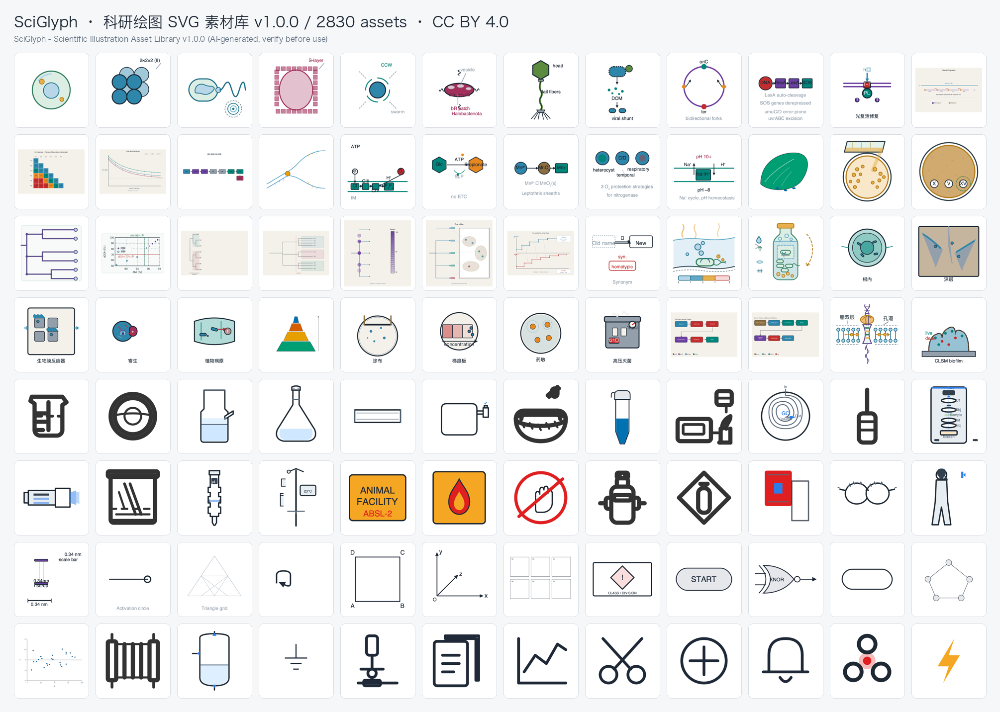
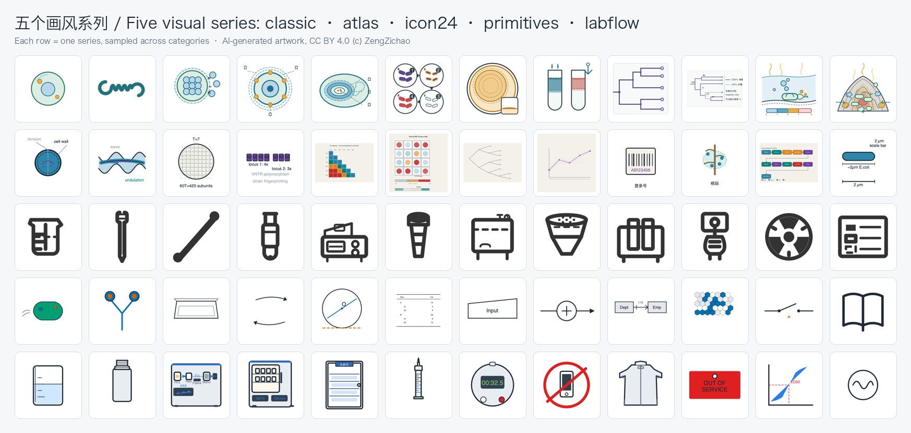
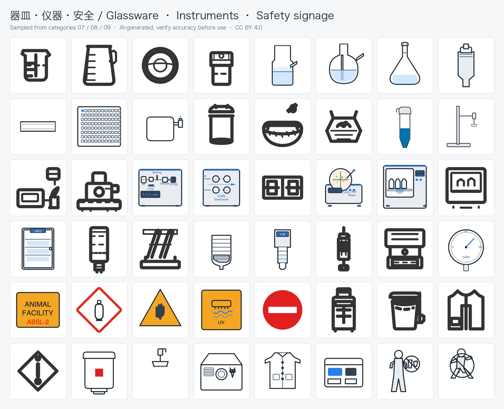
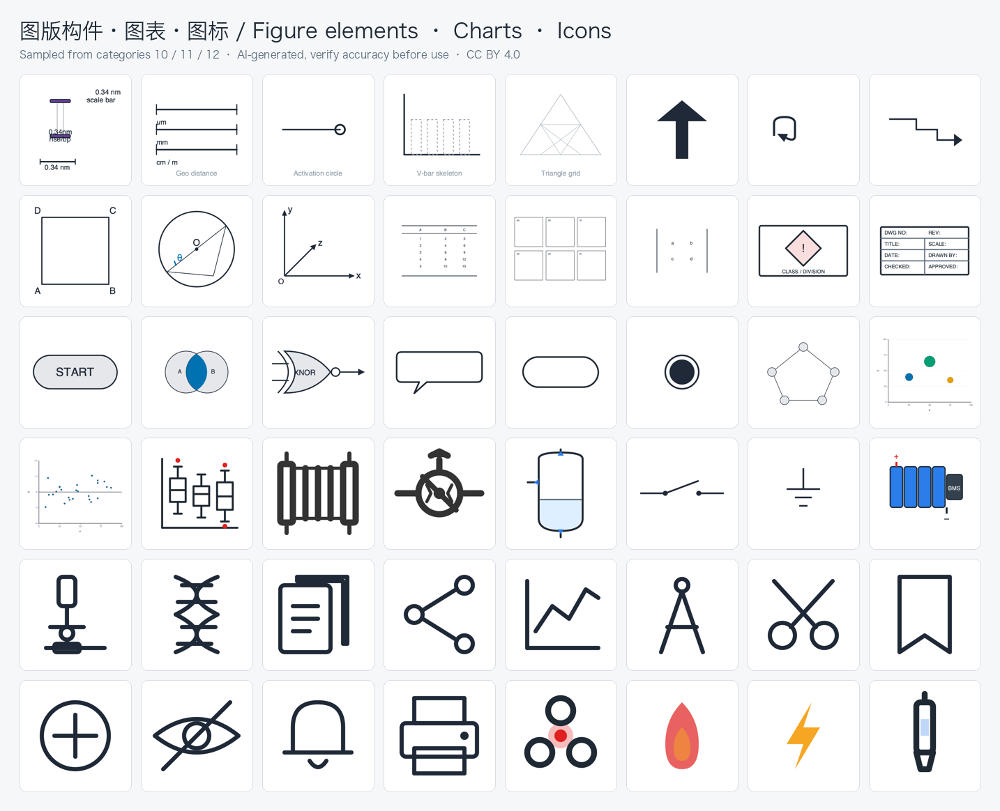

# SciGlyph · 绘图素材库（科研绘图 SVG 素材，v1.0.0）

**SciGlyph** —— 面向科研绘图的开源 SVG 素材库：**2830 个主素材**（另有 260 个 `.en.svg` 英文文本变体），按 12 个学科大类组织，含五个画风系列与三种形态（插画/示意图/图标）。

> ⚠️ **AI 生成声明**：本库全部素材由 AI（大模型）辅助生成，可能存在科学性或事实性误差。**正式使用（尤其是论文发表）前，请对照权威文献与官方标准自行核实图中信息的准确性。**

## 预览









- 许可：素材 **CC BY 4.0**（权利人 ZengZichao）；工具与页面代码 **MIT**。
- 英文文档：[README.en.md](README.en.md)；画风系列说明：[README-SERIES.md](README-SERIES.md) / [README-SERIES.en.md](README-SERIES.en.md)。
- 浏览：直接双击打开根目录 `index.html`（离线可用，支持中英切换与亮暗主题）。
- 引用：见 [CITATION.cff](CITATION.cff) 与 [NOTICE](NOTICE)。

## 12 个学科大类

| 编号 | 大类 | 素材数 |
|---|---|---|
| 01-cells-microbes | 细胞与微生物形态结构（Cells & Microbes: Morphology and Structure） | 295 |
| 02-genetics-omics | 遗传信息与组学（Genetics & Omics） | 233 |
| 03-metabolism-phenotype | 代谢与生理表型（Metabolism & Physiological Phenotype） | 105 |
| 04-phylogeny-evolution | 系统发育与进化（Phylogeny & Evolution） | 201 |
| 05-ecology-biotech | 生态·生境与应用（Ecology, Habitats & Applications） | 121 |
| 06-lab-methods | 实验方法与流程（Lab Methods & Workflows） | 140 |
| 07-glassware-consumables | 器皿·耗材与通用器材（Glassware, Consumables & General Labware） | 244 |
| 08-instruments-apparatus | 仪器与装置（Instruments & Apparatus） | 440 |
| 09-safety-signage | 安全·防护与标识（Safety & Signage） | 191 |
| 10-figure-elements | 图版构件（Figure Elements） | 325 |
| 11-diagrams-charts | 图示语法·流程与图表（Diagrams, Flows & Charts） | 437 |
| 12-icons-ui | 通用图标与 UI（Icons & UI） | 98 |
| | **合计** | **2830** |

形态分布：插画 1102 · 示意图表 1224 · 图标 504。

## 使用约定

- 文件名 `NNN-slug-en.svg`（三位序号 + 全局唯一 kebab 英文 slug）；含中文渲染文本的素材配有同名 `.en.svg` 英文版。
- 全部素材：零脚本、零外链、零内嵌位图；颜色为字面 hex；中文版字体链含 CJK 回退族。
- 每个素材携带 `data-license="CC-BY-4.0" data-copyright="ZengZichao"`；manifest 每条含 license/license_uri/attribution。
- 质检总闸门：`python3 tools/check_repo.py`（结构/命名/manifest/SVG 安全/许可/字体链/字号下限/标签零重叠/文字出画/安全标志对称/zh-en 配对）。

## 目录结构

```
绘图素材库/
├── README.md / README.en.md / README-SERIES.md / README-SERIES.en.md
├── LICENSE (MIT) / LICENSE-ASSETS (CC BY 4.0) / NOTICE / CITATION.cff
├── index.html            # 唯一画廊（搜索/过滤/中英切换/亮暗主题）
├── preview/              # 整合预览图（sciglyph-*.png）
├── assets/01..12-*/      # 12 大类，每类含子目录与 SPEC
└── tools/                # 质检与构建工具
```
